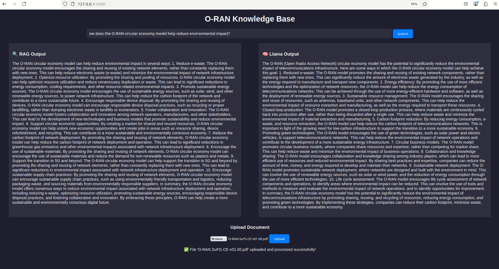

# Developing a Retrieval-Augmented Generation (RAG) Pipeline for Domain-Specific Question Answering on O-RAN Specification Documents

This repository contains code, resources, and outputs for processing, analyzing, and utilizing O-RAN specifications using Large Language Models (LLMs). The goal of this project is to develop a pipeline for extracting, summarizing, and querying information from O-RAN specification documents, enabling efficient insights and applications.

---

## Repository Structure

### Code/
#### oran_rag_pipeline/
A script-based pipeline for processing, embedding, and retrieving O-RAN specification documents.

##### `step1_document_loading.py`
- Loads and preprocesses O-RAN documents (PDF, Word).
- Extracts metadata and cleans text.

##### `step2_document_chunking.py`
- Splits the extracted text into manageable chunks.
- Preserves metadata for each chunk.

##### `step3_document_embedding.py`
- Converts document chunks into vector embeddings using a transformer-based model.
- Saves embeddings for retrieval.

##### `step4_vector_store.py`
- Stores vector embeddings along with metadata for efficient retrieval.

##### `step5_retrieval_testing.py`
- Handles retrieval and question answering over O-RAN documents.
- Uses the stored embeddings to find relevant document sections based on queries.

##### `rag_evaluation.py`
- Evaluates the effectiveness of the retrieval system.
- Runs performance tests on the retrieval pipeline.

##### `run_pipeline.sh`
- Bash script to automate the execution of the entire pipeline.
- Runs document processing, embedding, storage, and retrieval in sequence.

#### flask_rag_app/
A Flask-based web application for interactive retrieval and question answering.

##### `app.py`
- Main Flask application that handles web requests.
- Provides a UI for document uploads and query-based retrieval.

##### `step1_step2_document_loading_chunking.py`
- Loads O-RAN documents (PDF, Word) and preprocesses them.
- Splits the documents into smaller chunks while retaining metadata.

##### `step3_document_embedding.py`
- Generates vector embeddings for document chunks using a transformer-based model.
- Saves embeddings for retrieval.

##### `step4_vector_store.py`
- Stores the generated vector embeddings along with metadata.
- Enables efficient retrieval of relevant document sections.

##### `step5_retrieval.py`
- Handles document retrieval and question-answering over stored embeddings.
- Uses the stored document representations to return relevant sections based on user queries.

##### `templates/`
- Contains HTML templates for the web interface.
- Includes pages for document uploads and query submission.

##### `uploads/`
- Directory for storing uploaded O-RAN documents.
- Allows users to add new documents for processing.

## Hardcoded Paths in Code (Update if Needed)

### **Document Processing (Step 1 & Step 2)**
- **`INPUT_DIR = "/home/sswarna/Documents/oran_docs"`**  
  - **Purpose:** Directory where O-RAN documents (PDF, DOCX) are stored.  
  - *Update this if your documents are stored elsewhere.*

- **`OUTPUT_BASE_DIR = "/home/sswarna/Documents/oran_docs/output_all"`**  
  - **Purpose:** Stores processed outputs (extracted text, metadata).  
  - *Modify this path if you need outputs in a different location.*

- **`CHUNKS_OUTPUT_BASE_DIR = os.path.join(OUTPUT_BASE_DIR, "Step2_chunks")`**  
  - **Purpose:** Stores chunked document text for further processing.  
  - *Ensure this directory exists or update it based on your structure.*

- **Per-Year Output Directories:**
  - **`year_output_dir = os.path.join(OUTPUT_BASE_DIR, f"Output_{year}")`**  
    - Stores extracted text and metadata per year (2022, 2023, 2024).
  - **`year_chunks_output_dir = os.path.join(CHUNKS_OUTPUT_BASE_DIR, f"Output_{year}")`**  
    - Stores chunked text data per year.

---

### **Embedding Generation (Step 3)**
- **`CHUNKS_INPUT_BASE_DIR = "/home/sswarna/Documents/oran_docs/output_all/Step2_chunks"`**  
  - **Purpose:** Input directory where chunked text from Step 2 is stored.  
  - *Ensure this path is updated correctly if the chunking directory changes.*

- **`EMBEDDINGS_OUTPUT_BASE_DIR = "/home/sswarna/Documents/oran_docs/output_all/Step3_Embeddings"`**  
  - **Purpose:** Stores generated embeddings for document chunks.  
  - *Change this path if embeddings need to be saved elsewhere.*

- **`MODEL_PATH = "/home/sswarna/models/all-MiniLM-L12-v2"`**  
  - **Purpose:** Path to the local embedding model used for generating embeddings.  
  - *Ensure this model is correctly installed at the specified path.*

---

### **Vector Store Creation (Step 4)**
- **`EMBEDDINGS_INPUT_DIR = "/home/sswarna/Documents/oran_docs/output_all/Step3_Embeddings"`**  
  - **Purpose:** Input directory containing generated embeddings from Step 3.  
  - *Modify this if embeddings are stored elsewhere.*

- **`CHROMA_DB_DIR = "/home/sswarna/Documents/oran_docs/oran_rag_pipeline/chroma_index"`**  
  - **Purpose:** Stores ChromaDB vector database files.  
  - *Make sure this path is correct or update it based on your directory structure.*

- **`COLLECTION_NAME = "oran_docs"`**  
  - **Purpose:** Defines the ChromaDB collection name for storing document vectors.  

---

### **Retrieval and Query Execution (Step 5)**
- **`CHROMA_DB_DIR = "/home/sswarna/Documents/oran_docs/oran_rag_pipeline/chroma_index"`**  
  - **Purpose:** Directory where ChromaDB is stored for retrieval.  
  - *Ensure this is the correct path before querying.*

- **`OLLAMA_URL = "http://localhost:11434/api/generate"`**  
  - **Purpose:** API endpoint for Ollama LLM to generate responses.  
  - *Ensure Ollama is running and accessible at this URL.*

- **`OLLAMA_MODEL = "llama2:7b"`**  
  - **Purpose:** Model used by Ollama for answering queries.  
  - *Modify this if using a different model.*

- **`EMBEDDING_MODEL_PATH = "/home/sswarna/models/all-MiniLM-L12-v2"`**  
  - **Purpose:** Embedding model path for query vector generation.  
  - *Ensure this path is correct before running retrieval.*

---

## **What to Do Next?**
- If running the pipeline on a different machine or directory, **update the above paths** in the respective scripts.
- Ensure all referenced directories exist **before executing the scripts**.
- If using different storage locations, update **both input and output paths** accordingly.

---

## **Other Key Files**
This repository contains additional key files related to the evaluation, architecture, and UI representation of the project.

### **Diagrams & Visual Representations**
- **Pipeline Diagram:**  
    
  - Represents the full architecture of document ingestion, retrieval, and response generation.

- **Evaluation Metrics Table:**  
    
  - Displays the BLEU, ROUGE-1, Semantic Similarity, and KG Score for different query types.

- **Terminal Execution Output:**  
    
  - Captures the live execution and retrieval response generation in the command-line interface.

- **UI-Based Document Query Interface:**  
    
  - Represents the web-based UI for document uploads and retrieval-based question answering.

### **Presentation & Documentation**
- **Final Research Paper on RAG Pipeline:**  
  📄 [Developing a Retrieval-Augmented Generation (RAG) Pipeline for Domain-Specific Question Answering on O-RAN Specification Documents](Developing_a_Retrieval_Augmented_Generation__RAG__Pipeline_for_Domain_Specific_Question_Answering_on_O_RAN_Specification_Documents.pdf)  
  - A comprehensive research document detailing the problem, solution, and implementation of the RAG system.

- **Project Presentation (Slides):**  
  📄 [Retrieval-Based Question Answering for O-RAN Documents - Presentation](PPT_pdf.pdf)  
  - A PowerPoint presentation summarizing the approach, challenges, performance evaluation, and future improvements.

---

## **Prerequisites**
- pymupdf
- python-docx
- tqdm
- tiktoken
- sentence-transformers
- chromadb
- flask
- werkzeug
- requests
- python-Levenshtein
- Ollama (for LLM model)
- all-MiniLM-L12-v2
- Change the paths for Embedding model and LLM

---
## Input Files / Dataset
https://drive.google.com/file/d/1IJHSt6wzksOw-2Pp5YyE_uShxrG3O6nT/view?usp=sharing
